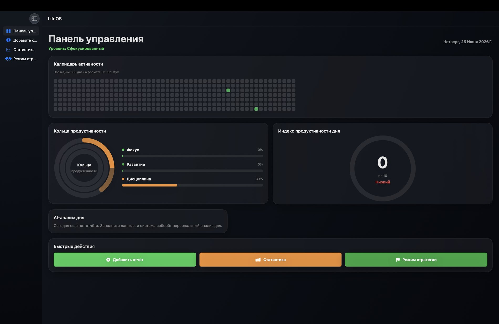

# LifeOS

`LifeOS` — нативное macOS-приложение на SwiftUI для управления личной продуктивностью, привычками, целями и проектами.



## Что реализовано

- Панель управления с GitHub-style календарём активности (7×52).
- Кольца продуктивности в стиле Apple Fitness:
  - Фокус
  - Развитие
  - Дисциплина
- Индекс продуктивности дня (0–10) с цветовыми уровнями:
  - 0–2: Низкий
  - 3–5: Средний
  - 6–8: Высокий
  - 9–10: Элита
- Быстрые действия:
  - Добавить отчёт
  - Статистика
  - Режим стратегии
- Экран добавления отчёта с локальным сохранением.
- AI-анализ дня (на русском) на основе score, streak и привычек.
- Экран статистики с метриками и графиками (Swift Charts).
- Карточка дня с просмотром и редактированием.
- Режим стратегии: цели, проекты, прогресс, приоритет и дедлайн.
- Экспорт данных в JSON.

## Технологии

- Swift
- SwiftUI
- Combine
- SQLite (через `SQLite3`)
- MVVM
- Swift Charts

## Структура проекта

```text
LifeOS/
  Models/
  Views/
    Components/
  ViewModels/
  Services/
  Database/
  Assets/
```

## Как открыть проект в Xcode

1. Откройте Xcode.
2. Выберите `File` -> `Open...`.
3. Выберите файл `Package.swift` в корне проекта.
4. Дождитесь загрузки Swift Package.

## Как собрать приложение

1. В Xcode выберите схему `LifeOS`.
2. Выберите таргет запуска `My Mac`.
3. Нажмите `Product` -> `Build` (или `Cmd+B`).

## Как запустить LifeOS

1. В Xcode нажмите `Run` (или `Cmd+R`).
2. Приложение откроется в отдельном окне macOS.

## Локальное хранение данных

- SQLite база: `~/Library/Application Support/LifeOS/lifeos.sqlite`
- Экспорт JSON выполняется через системный диалог сохранения.

## Примечания

- Весь интерфейс приложения выполнен на русском языке.
- Приложение оптимизировано под тёмную тему и macOS-стиль с glass-панелями и анимациями.
