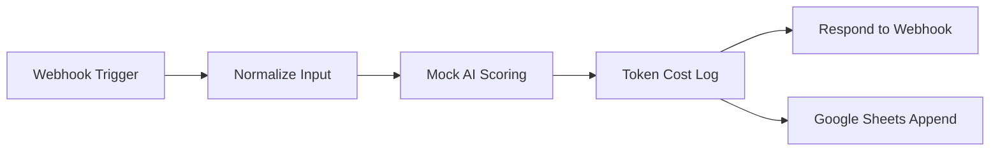

# Marketplace Recruiter AI Copilot

n8n-автоматизация для первичного скоринга кандидатов на вакансии компаний, которые продают на Wildberries и Ozon. Проект сделан как портфолио-кейс под AI/recruitment-задачи: webhook принимает вакансию и резюме, mock AI node оценивает релевантность, формирует summary для рекрутера, сообщение кандидату, вопросы для интервью и лог стоимости токенов.

## Что внутри

- `workflow/marketplace-recruiter-ai-copilot.json` - workflow для импорта в n8n.
- `data/sample-request.json` - демо-запрос для webhook.
- `data/google-sheets-columns.csv` - заголовки таблицы Google Sheets.
- `portfolio-case.md` - короткое описание кейса для отклика или собеседования.

## Схема workflow



## Быстрый запуск

1. Открой n8n.
2. Импортируй `workflow/marketplace-recruiter-ai-copilot.json`.
3. Открой node `Google Sheets Append`.
4. Замени `REPLACE_WITH_GOOGLE_SHEET_ID` на id своей таблицы.
5. Добавь Google Sheets credentials.
6. Создай лист `Candidates` и вставь заголовки из `data/google-sheets-columns.csv`.
7. Активируй workflow.
8. Отправь POST-запрос на production webhook URL.

Пример для локального n8n:

```bash
curl -X POST "http://localhost:5678/webhook/marketplace-recruiter-copilot" \
  -H "Content-Type: application/json" \
  --data @data/sample-request.json
```

Для тестового режима в n8n можно нажать `Listen for test event` в `Webhook Trigger` и отправить запрос на test URL, который покажет интерфейс n8n.

## Вход webhook

```json
{
  "job_title": "Менеджер по маркетплейсам Wildberries / Ozon",
  "marketplace": "Wildberries",
  "category": "Товары для дома",
  "must_have": ["опыт работы с Wildberries от 1 года", "ведение рекламных кампаний"],
  "nice_to_have": ["MPStats", "Excel"],
  "candidate_name": "Алина Петрова",
  "candidate_resume": "Текст резюме кандидата...",
  "salary_expectation": "110000 RUB",
  "contact": "@alina_marketplace"
}
```

## Выход webhook

Workflow возвращает JSON-карточку кандидата:

- `fit_score` - оценка совпадения от 0 до 100.
- `verdict` - `strong_match`, `needs_review` или `low_match`.
- `strengths` - найденные сильные стороны.
- `risks` - риски и пробелы.
- `recruiter_summary` - короткое резюме для рекрутера.
- `candidate_message` - персональное первое сообщение кандидату.
- `follow_up_questions` - вопросы для первичного интервью.
- `estimated_tokens` и `estimated_cost_rub` - примерный контроль расхода AI-агента.

## Как заменить mock AI на Claude или OpenAI

В текущей версии node `Mock AI Scoring` написан как заглушка, чтобы проект можно было показать без API-ключей. Для живого LLM:

1. Замени `Mock AI Scoring` на `HTTP Request`.
2. Оставь входной формат после `Normalize Input` без изменений.
3. Отправляй в модель `job`, `candidate` и строгую JSON-схему ответа.
4. Верни из LLM те же поля, которые сейчас формирует mock node: `fit_score`, `verdict`, `strengths`, `risks`, `recruiter_summary`, `candidate_message`, `follow_up_questions`.
5. Оставь `Token Cost Log`, `Google Sheets Append` и `Respond to Webhook` как есть.

Мини-промпт для реального LLM:

```text
Ты AI-рекрутер для вакансий Wildberries/Ozon. Оцени кандидата по вакансии.
Верни только JSON с полями: fit_score, verdict, strengths, risks,
recruiter_summary, candidate_message, follow_up_questions.
Учитывай must_have как критичные требования, nice_to_have как бонус.
Пиши кратко, по-русски, без выдумывания фактов.
```

## Почему это хороший портфолио-кейс

Проект показывает не просто знание n8n, а понимание бизнес-процесса рекрутинга: первичный скоринг, структурированный AI-output, контроль стоимости токенов, сохранение результата в таблицу и готовые тексты для коммуникации. Для rodinka.recruitment это близко к реальной задаче: быстрее разбирать входящих кандидатов на роли для WB/Ozon-компаний.

## Возможное развитие

- Telegram-уведомление рекрутеру по кандидатам с `strong_match`.
- Реальный Claude/OpenAI HTTP Request вместо mock node.
- Отдельный workflow для генерации вакансий из клиентского брифа.
- Dashboard по стоимости запросов, ошибкам и качеству скоринга.
