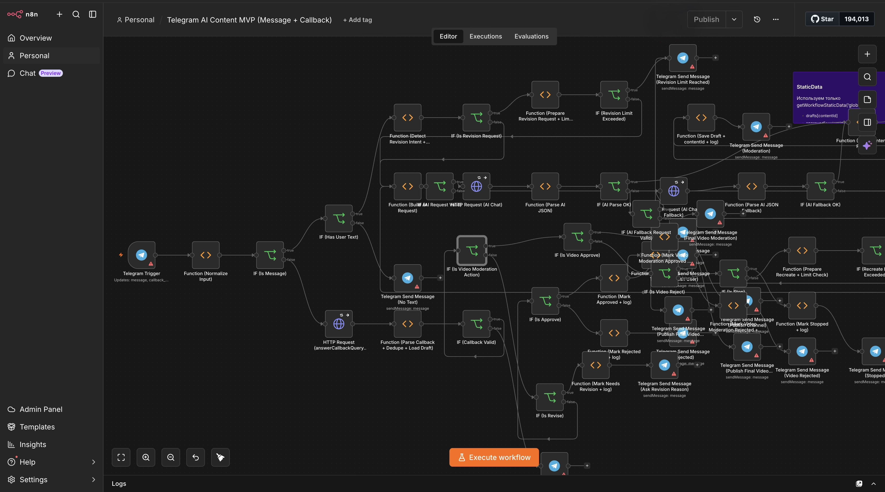

# n8n AI Automation Factory

Коллекция n8n automation workflow для портфолио: от маленьких debug/http-прототипов до большой Telegram AI content factory.

## Workflows

| Workflow | Nodes | Connections | Main Node Types | Description |
|---|---:|---:|---|---|
| [Telegram AI Content Factory](workflows/telegram-ai-content-factory.json) | 133 | 113 | function x50, if x43, httpRequest x16, telegram x15, stickyNote x4 | Большая n8n AI-фабрика для Telegram-контента: прием сообщений и callback-кнопок, генерация сценария, fallback AI, модерация, пересборка, публикация и логирование. |
| [Auto-Debug Workflow Micro](workflows/auto-debug-workflow-micro.json) | 14 | 13 | function x7, httpRequest x4, if x2, manualTrigger x1 | Маленькая автоматизация для debug/fix loop: получает контекст ошибки, готовит запрос, проверяет ответ и возвращает patch/fix payload. |
| [HTTP Request Prototype](workflows/http-request-prototype.json) | 2 | 1 | httpRequest x1, manualTrigger x1 | Мини-прототип из локальной n8n database: manual trigger + HTTP request, сохранен как пример самой маленькой автоматизации. |
| [Marketplace Recruiter AI Copilot](workflows/marketplace-recruiter-ai-copilot.json) | 6 | 4 | code x3, googleSheets x1, respondToWebhook x1, webhook x1 | Бизнес-автоматизация для рекрутинга: webhook, scoring, summary, Google Sheets/операционный вывод. |

## Что показывает проект

- Проектирование n8n workflow разного масштаба: от 2-14 нод до большой AI-фабрики.
- Telegram automation с message/callback ветками, модерацией, revision flow и публикацией.
- AI fallback-подходы, парсинг JSON, обработка ошибок и debug/fix loop.
- Бизнес-автоматизации: recruiter/candidate scoring и операционный workflow.

## Безопасность публикации

Все JSON-файлы в этой папке являются sanitized snapshots:

- удалены `credentials`, workflow IDs, webhook IDs, `pinData`, `staticData`;
- hardcoded API-key-like строки заменены placeholder-ами;
- Telegram/chat/admin/channel/user identifiers заменены или обезличены;
- workflow выключены через `active: false`.

Эти файлы предназначены для просмотра архитектуры и логики автоматизаций, а не для production-запуска без настройки credentials.
