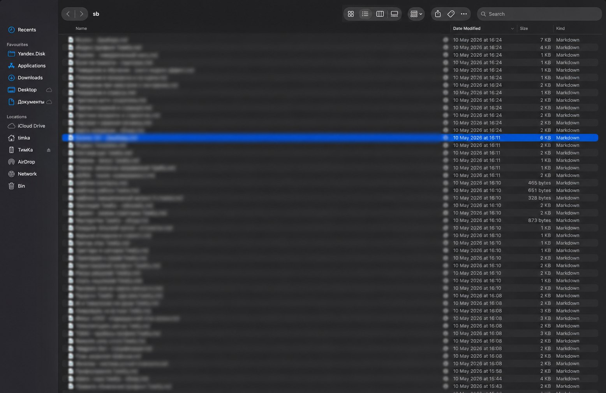
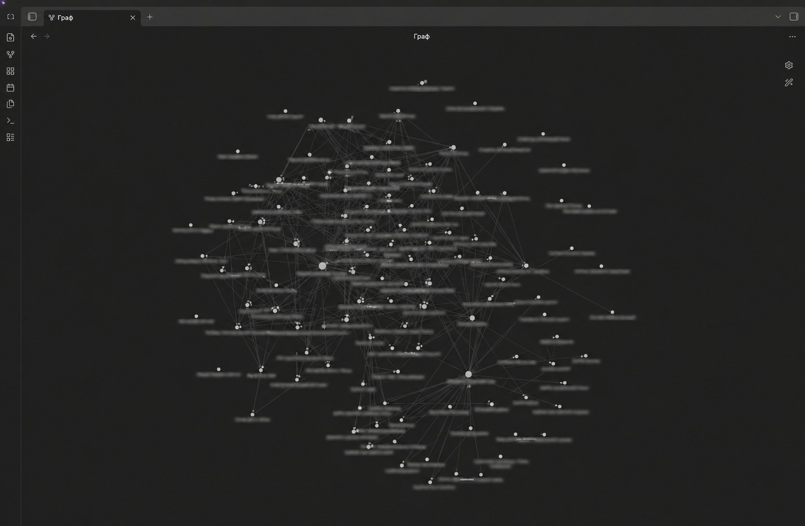

# Second Brain Knowledge System

Визуальный кейс персональной базы знаний: markdown-структура, Obsidian graph view и системная организация заметок.

## Что показывает проект

- Архитектуру персональной базы знаний и файловую структуру markdown-хранилища.
- Obsidian graph как визуализацию связей между заметками.
- Подход к second brain / knowledge management без публикации приватного содержимого заметок.

## Безопасность публикации

Скриншоты намеренно размыты: названия заметок и приватные данные не раскрываются. В репозиторий добавлен только визуальный кейс, не исходная база знаний.
